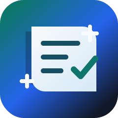
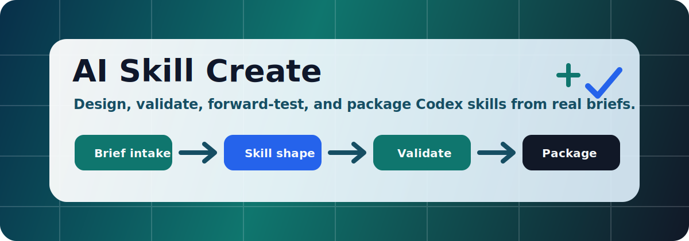

# 🛠️ AI Skill Create

<p align="center">
  
  <br />
  
</p>

<p align="center">
  <a href="README.de.md">🇩🇪 Deutsch</a> ·
  <a href="README.es.md">🇪🇸 Español</a> ·
  <a href="README.md">🇬🇧 English</a> ·
  <a href="README.pt-BR.md">🇧🇷 Português (Brasil)</a> ·
  <a href="README.tr.md">🇹🇷 Türkçe</a> ·
  <a href="README.fr.md">🇫🇷 French</a>
</p>

**AI Skill Create**, gerçek brief, örnek, dosya ve talimatlardan daha iyi Codex skill’leri üretmek için hazırlanmış public-ready bir Codex skill ve plugin paketidir.

Amaç basit: Codex bir skill oluştururken sadece şablon doldurmasın; skill’i anlasın, doğru yapıyı seçsin, doğrulasın, forward-test etsin, güvenli paketlesin ve başkalarının rahatça kurabileceği hale getirsin.

## ✨ Ne Sağlar?

- 🎯 güçlü ve tetiklenebilir `SKILL.md` açıklamaları
- 🧭 kısa ana workflow ve ayrı referans dosyaları
- ⚙️ gerekli yerde deterministic helper scriptleri
- 🧪 validation ve forward-test promptları
- 📦 plugin ve marketplace metadata
- 🪟 Windows-first install ve dry-run scriptleri
- 🔐 public repo için secret scan ve güvenlik kontrolleri

## 🚀 Hızlı Başlangıç

Repoyu klonla:

```powershell
git clone https://github.com/ucsahinn/ai-skill-create.git
cd ai-skill-create
```

Kurulumu önce dry-run ile gör:

```powershell
powershell.exe -NoProfile -ExecutionPolicy Bypass -File scripts/install.ps1 -DryRun
```

Skill’i Codex home içine kur:

```powershell
powershell.exe -NoProfile -ExecutionPolicy Bypass -File scripts/install.ps1 -Yes
```

Sonra yeni bir Codex thread’i açıp şöyle çağır:

```text
Use $ai-skill-create to create a new Codex skill from this brief.
```

## 🧩 Plugin Yapısı

Paket self-contained çalışır:

```text
plugins/ai-skill-create/
  .codex-plugin/plugin.json
  skills/ai-skill-create/
    SKILL.md
    agents/openai.yaml
    references/
    scripts/
    assets/
```

Repo-local marketplace dosyası: [.agents/plugins/marketplace.json](.agents/plugins/marketplace.json)

## ✅ Doğrulama

Tüm yerel kontrol zinciri:

```powershell
npm run validate
```

Bu kontrol şunları doğrular:

- repo yapısı
- `SKILL.md` frontmatter ve trigger kelimeleri
- `agents/openai.yaml`
- plugin manifest
- marketplace metadata
- markdown linkleri
- script syntax
- install dry-run
- Gitleaks secret scan

## 🧠 Nasıl Çalışır?

`$ai-skill-create` çağrıldığında Codex’i şu akıştan geçirir:

1. brief ve örnekleri anla
2. instruction-only, references, scripts, assets veya plugin kararını ver
3. kısa ve net `SKILL.md` yaz
4. detayları referans dosyalarına taşı
5. sadece gerçekten faydalı scriptleri ekle
6. yapıyı ve güvenliği doğrula
7. gerçekçi forward-test promptlarıyla dene
8. public repo, install ve release kapılarını hazırla

## 📚 Dokümanlar

- [Install Guide](docs/INSTALL.md)
- [Usage Guide](docs/USAGE.md)
- [Skill Structure](docs/SKILL_STRUCTURE.md)
- [Validation](docs/VALIDATION.md)
- [Plugin And Marketplace](docs/PLUGIN_AND_MARKETPLACE.md)
- [Windows Notes](docs/WINDOWS.md)
- [Public Repo Checklist](docs/PUBLIC_REPO_CHECKLIST.md)
- [SEO And Discoverability](docs/SEO.md)
- [GitHub Settings](docs/GITHUB_SETTINGS.md)
- [Sources](docs/SOURCES.md)

## 🔐 Güvenlik Modeli

Skill üreten bir araç, agent davranışını etkileyebilir. Bu yüzden brief, örnek, web sayfası, MCP çıktısı, GitHub issue ve üretilen metinler güvenilmeyen input kabul edilir.

Bu repo özellikle şunlardan kaçınır:

- gerçek secret veya private data
- geniş varsayılan izinler
- gizli override talimatları
- onaysız global write
- destructive cleanup
- curl-pipe-shell kurulumları

Detaylar: [SAFE_GENERATION.md](SAFE_GENERATION.md), [THREAT_MODEL.md](THREAT_MODEL.md), [SECURITY.md](SECURITY.md).

## 📄 Lisans

MIT. Bkz. [LICENSE](LICENSE).
